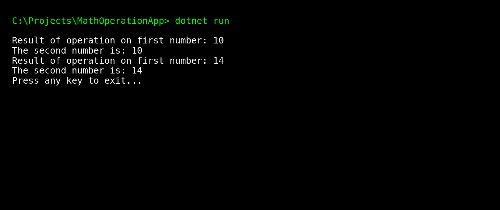

# MathOperationApp

This is a simple C# console application created as part of a coding exercise.  
It demonstrates how to create a class, define a method with parameters, and call it using both positional and named arguments.

## Features
- Defines a `MathOperation` class with a method that takes two integers.
- Performs a math operation (multiplying the first integer by 2).
- Displays the result of the operation and the second integer.
- Shows how to call a method using both positional arguments and named parameters.
- Fully commented code for easy understanding.

## How to Run
1. Make sure you have [.NET 6.0 SDK](https://dotnet.microsoft.com/en-us/download) installed on your machine.
2. Download or clone this repository.
3. Open a terminal in the project folder and run:
   ```bash
   dotnet run
   ```

## Example Output
```
Result of operation on first number: 10
The second number is: 10
Result of operation on first number: 14
The second number is: 14
Press any key to exit...
```

## Repository Purpose
This project was created as a learning exercise.  
It includes:
- Clean and commented code for learning.  
- A simple example of object-oriented programming in C#.  


## Preview
Here’s how the output looks when running the app:


